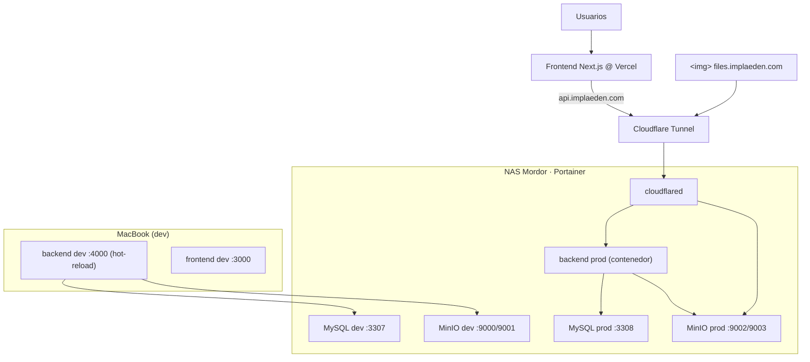

# Estado de la migración a infraestructura local — Implaedén

> Resumen del avance. Los **secretos** viven en `infra/.env.dev` / `infra/.env.prod`
> y en los `README` de `infra/`, no en este documento.

## Objetivo
Migrar de la nube (AWS RDS + S3, Render) a **self-hosted** en el NAS "Mordor"
con Docker/Portainer. Frontend sigue en Vercel; backend expuesto por Cloudflare Tunnel.

## Estado: DEV y PROD operativos ✅

### Arquitectura

### Componentes y puertos
| | DEV | PROD |
|---|---|---|
| MySQL 8 | NAS `:3307` | NAS `:3308` |
| MinIO (S3) | NAS `:9000` / consola `:9001` | NAS `:9002` / consola `:9003` |
| Adminer | NAS `:8091` | NAS `:8092` |
| Backend Express | Mac `:4000` (nodemon) | contenedor NAS `:4001` + túnel |
| Frontend | Mac `:3000` | Vercel |
| Público | — | `api.implaeden.com`, `files.implaeden.com` |

- Rutas en el NAS: `/volume1/home/ochoagram/implaeden-dev` y `.../implaeden-prod`.
- Acceso SSH desde la Mac: alias `mordor` (`192.168.100.10`).

## Cambios de código (backend)
- `config/s3.js`: cliente S3 compartido → MinIO si hay `S3_ENDPOINT` (path-style), AWS S3 si no.
- Rutas de subida (`uploads`, `treatmentEvidences`, `pacientes`, `clinicalHistories`, `tratamientos`)
  usan el cliente compartido y devuelven `publicUrl(key)`.
- `routes/auth.js`: cookie de refresh con `COOKIE_SAMESITE` (dev `lax`; prod `none`+`secure`).
- `routes/pacientes.js`: `LIMIT/OFFSET` forzados a entero (MySQL 8 rechaza `LIMIT '20'`).
- Backend prod en contenedor: imagen `node:20-bookworm-slim` + código bind-mount + `npm install`
  (hay `Dockerfile` para imagen limpia). **`JWT_SECRET` del backend debe COINCIDIR con el del frontend.**

## Datos
- BD dev = `dev-implaeden.sql`; BD prod = `implaeden-db.sql`. Tras la migración 002, **ambas tienen el mismo esquema**.
- Archivos: respaldo del bucket S3 (~183 MB) sembrado en MinIO dev y prod.
- URLs de archivos reescritas en BD de `…s3.amazonaws.com` → `files.implaeden.com` (independencia de AWS).
- Content-Type corregido en MinIO (los `_blob` sin extensión quedaban `octet-stream`).

## Migraciones de BD
- Runner propio: `scripts/migrate.js` + carpeta `migrations/` (`schema_migrations`, forward-only, idempotente).
- `npm run migrate:dev` (dev) · `npm run migrate` (prod, desde consola del contenedor o con env de prod).
- Ver `migrations/README.md`. Flujo de deploy: **BD → Backend → Frontend**.

## Pendientes
- 🔮 **Futuro (recomendado): dev/staging expuesto para previews de Vercel.**
  Backend dev en contenedor en el NAS + `api-dev.implaeden.com` / `files-dev.implaeden.com`
  en el túnel + `NEXT_PUBLIC_API_URL` de dev en el scope **Preview** de Vercel.
  Hoy el backend dev corre solo en la Mac, por lo que las previews aún no lo alcanzan.
- 🔐 Rotar secretos débiles/expuestos (`JWT_SECRET` en backend + Vercel; contraseña de Portainer).
- 💾 Backups automáticos de prod (dump MySQL + copia de `minio/data`).
- 🔊 AWS Polly/TTS: decidir mantener / deshabilitar / TTS local (sin llaves AWS en prod hoy).
- 🐘 Migración futura a PostgreSQL + pgvector.
