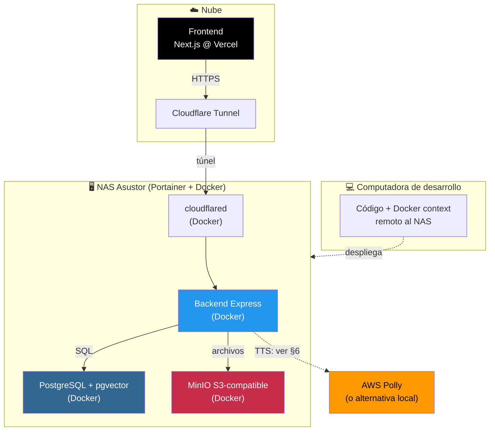

# Proyecto: Migración de Implaedén a Infraestructura Local

> Documento de arranque para **Claude Code**. Se ejecuta desde la raíz de un
> monorepo que contiene el frontend y el backend. Describe objetivo, stack real,
> arquitectura y fases verificables para levantar todo en local (NAS + Docker).

---

## 1. Objetivo

Migrar la infraestructura de Implaedén desde la nube (AWS, Render) a un entorno
**self-hosted** en un NAS con Docker, reduciendo costos a ~$0, manteniendo el
frontend en Vercel y exponiendo el backend local mediante túnel de Cloudflare.

---

## 2. Estructura del monorepo

```
implaeden/                       # <- raíz; Claude Code arranca aquí
├── implaeden-frontend/          # Next.js (deploy en Vercel, sin cambios de infra)
├── implaeden_backend/           # Express + JWT (se conteneriza)
├── infra/                       # docker-compose, configs de MinIO/PostgreSQL/cloudflared
│   ├── docker-compose.yml
│   ├── cloudflared/
│   └── postgres/
├── db/                          # dumps MySQL de origen + scripts de migración
│   ├── dumps/                   # implaeden.sql, dev-implaeden.sql, implaeden-db.sql
│   └── migration/               # scripts pgloader + correcciones de esquema
└── docs/
    └── IMPLAEDEN_LOCAL_SETUP.md # este documento
```

---

## 3. Stack real y destino de cada componente

| Componente | Origen (antes) | Destino (ahora) | Corre en |
|---|---|---|---|
| **Frontend** | Next.js @ Vercel | Sin cambio | Vercel (nube) |
| **Backend** | Express @ Render.com | Contenedor Docker | NAS local |
| **Base de datos** | MySQL @ AWS RDS | **PostgreSQL + pgvector** | NAS local (Docker) |
| **Almacenamiento de archivos** | AWS S3 | **MinIO** (S3-compatible) | NAS local (Docker) |
| **Text-to-Speech (Polly)** | AWS Polly | ⚠️ **Decisión pendiente** (ver §6) | Por definir |

### Backend: hechos relevantes (según documentación)
- **Framework:** Express (`app.js`), rutas en `/routes`.
- **Auth:** JWT vía `Authorization: Bearer <token>` (o cookie `token`). Rutas públicas: `/auth`, `/test`, `/uploads`.
- **Dependencias de AWS detectadas:**
  - **S3** → subida de archivos (`/uploads`, evidencias, historiales, documentos). Reemplazable por MinIO.
  - **Polly** → TTS en `/pacientes/:patientId/resumen/tts`. **NO reemplazable por MinIO.**
- **AI chat:** `/ai/chat` con streaming **SSE** (encaja con pgvector).
- **CORS ya configurado:** acepta `http://localhost:3000` y `https://implaeden.vercel.app`.
- **Deuda técnica conocida** (heredada, revisar durante la migración):
  - `users.js` existe pero no está montado en `app.js`.
  - `/pacientes/:patientId/summary` está implementado dos veces en `pacientes.js`.
  - En `servicios.js`, `GET /:id/tratamientos` usa `patientId` sin definir (posible bug).

---

## 4. Arquitectura objetivo



---

## 5. Fases de implementación

> Ejecutar en orden. Verificar cada fase antes de avanzar.

### Fase 0 — Preparación
- [ ] Confirmar acceso a Portainer y Docker operativo en el NAS.
- [ ] Colocar ambos proyectos en el monorepo (`implaeden-frontend/`, `implaeden_backend/`).
- [ ] Crear `infra/docker-compose.yml` base y `.env.example` (sin secretos reales).
- [ ] Revisar el `.env` actual del backend e inventariar TODAS las variables (BD, AWS, JWT, correo, IA).

### Fase 1 — Base de datos: PostgreSQL + migración MySQL → PostgreSQL
- [ ] Levantar contenedor **PostgreSQL con pgvector** (`pgvector/pgvector:pg16`).
- [ ] Preparar **`pgloader`** para convertir los dumps.
- [ ] Migrar primero `dev-implaeden.sql` (entorno de prueba).
- [ ] Corregir incompatibilidades:
  - Tipos: `TINYINT(1)`→`BOOLEAN`, `DATETIME`→`TIMESTAMP`, `ENUM`→tipo/CHECK.
  - `AUTO_INCREMENT`→`SERIAL`/`IDENTITY`.
  - Backticks → comillas dobles o sin comillas.
  - Vista rota `payments_with_balance`: recrear o descartar.
- [ ] Verificar integridad: contar filas por tabla origen vs destino.
- [ ] `CREATE EXTENSION vector;` y validar.
- [ ] Repetir con la base de producción.
- [ ] **Adaptar el backend:** cambiar el driver/ORM de MySQL a PostgreSQL
      (revisar `config/` y las queries SQL crudas en cada archivo de `routes/`).

### Fase 2 — Almacenamiento: MinIO (reemplazo de S3)
- [ ] Levantar **MinIO** con volumen persistente.
- [ ] Crear bucket `implaeden` y políticas de acceso.
- [ ] Cargar el contenido respaldado del S3 original.
- [ ] Ajustar el cliente S3 del backend: `endpoint` a MinIO, `forcePathStyle: true`, credenciales MinIO.
- [ ] Probar subida/descarga en los endpoints que usan archivos
      (`/uploads`, evidencias, historiales, documentos de tratamiento).

### Fase 3 — Backend en Docker
- [ ] Crear `Dockerfile` para el backend Express (Node.js).
- [ ] Parametrizar por env: PostgreSQL, MinIO, JWT, correo, IA, (Polly si aplica).
- [ ] Levantar backend vía `docker-compose` junto a PostgreSQL y MinIO.
- [ ] Verificar conexión a BD (`GET /api/test/db-test`) y a almacenamiento.
- [ ] Probar auth (`POST /auth/login`) y endpoints CRUD principales.

### Fase 4 — Túnel de Cloudflare
- [ ] Levantar `cloudflared` como contenedor en el NAS.
- [ ] Configurar túnel al puerto interno del backend, con hostname público.
- [ ] **Cuidado con SSE:** verificar que `/ai/chat` (streaming) funcione a través del túnel
      (deshabilitar buffering si es necesario).
- [ ] Verificar acceso externo al backend.

### Fase 5 — Conectar el frontend (Vercel)
- [ ] Actualizar la variable de API del frontend en Vercel al hostname del túnel.
- [ ] Confirmar que el CORS del backend incluye el dominio de Vercel
      (ya acepta `https://implaeden.vercel.app`).
- [ ] Probar flujo completo: Vercel → túnel → backend → PostgreSQL/MinIO.
- [ ] Validar login (cookies/JWT a través del túnel: revisar `SameSite`/`Secure`).

### Fase 6 — Robustez y cierre
- [ ] `restart: unless-stopped` en todos los contenedores.
- [ ] Backups locales: dump periódico de PostgreSQL + respaldo de MinIO.
- [ ] Documentar arranque del stack desde cero.
- [ ] Resolver la deuda técnica heredada (ver §3).
- [ ] Prueba end-to-end de funcionalidades críticas.

---

## 6. Decisión pendiente: AWS Polly (TTS)

El endpoint `POST /pacientes/:patientId/resumen/tts` genera audio con **AWS Polly**.
MinIO **no** cubre esto. Opciones:

| Opción | Ventaja | Desventaja |
|---|---|---|
| **Mantener Polly** | Cero cambios de código, buena calidad | Sigue dependiendo de AWS (costo + credenciales) |
| **TTS local** (p. ej. Piper, Coqui) | 100% local, sin costo | Requiere integración y contenedor extra |
| **Otro TTS en nube** (Google, ElevenLabs) | Buena calidad | Costo + nueva integración |
| **Desactivar temporalmente** | Simplifica la migración inicial | Se pierde la función hasta reimplementar |

> **Recomendación:** en la migración inicial, mantener Polly funcionando (aislado tras
> su variable de entorno) y decidir el reemplazo local en una fase posterior, para no
> bloquear el resto del proyecto.

---

## 7. Puntos de atención (riesgos)

| Riesgo | Impacto | Mitigación |
|---|---|---|
| **MySQL → PostgreSQL** | Alto | `pgloader`, migrar dev primero, verificar filas, revisar queries crudas |
| **Queries SQL crudas en routes/** | Alto | Buscar sintaxis específica de MySQL en cada archivo y adaptarla |
| **SSE (`/ai/chat`) tras el túnel** | Medio | Desactivar buffering en Cloudflare; probar streaming |
| **Cookies JWT a través del túnel** | Medio | Revisar `SameSite=None; Secure` para cross-site Vercel↔túnel |
| **AWS Polly sin reemplazo** | Medio | Ver §6; aislar tras env, decidir después |
| **Persistencia en NAS** | Alto | Volúmenes Docker persistentes + backups |
| **Compatibilidad S3→MinIO** | Bajo-Medio | `forcePathStyle: true`, endpoint correcto |

---

## 8. Variables de entorno esperadas (borrador — completar desde el .env real)

```env
# --- PostgreSQL ---
POSTGRES_HOST=postgres
POSTGRES_PORT=5432
POSTGRES_DB=implaeden
POSTGRES_USER=implaeden
POSTGRES_PASSWORD=

# --- MinIO (S3-compatible) ---
S3_ENDPOINT=http://minio:9000
S3_ACCESS_KEY=
S3_SECRET_KEY=
S3_BUCKET=implaeden
S3_FORCE_PATH_STYLE=true

# --- Backend / Auth ---
NODE_ENV=production
PORT=
JWT_SECRET=
JWT_REFRESH_SECRET=
CORS_ORIGIN=https://implaeden.vercel.app

# --- Correo (endpoints /email) ---
SMTP_HOST=
SMTP_USER=
SMTP_PASS=

# --- IA (/ai/chat) ---
AI_API_KEY=

# --- AWS Polly (si se mantiene, ver §6) ---
AWS_ACCESS_KEY_ID=
AWS_SECRET_ACCESS_KEY=
AWS_REGION=us-east-2

# --- Cloudflare Tunnel ---
CLOUDFLARE_TUNNEL_TOKEN=
```

---

## 9. Primer entregable sugerido para Claude Code

Arrancar por **Fase 0 + Fase 1**:
1. Inventariar el `.env` real del backend y detectar todas las dependencias de AWS.
2. Generar `infra/docker-compose.yml` con PostgreSQL (pgvector) + MinIO.
3. Preparar y ejecutar `pgloader` sobre `dev-implaeden.sql` como primer caso de prueba.
4. Identificar en `routes/` las queries con sintaxis específica de MySQL a adaptar.

> Confirmar la ruta de los dumps `.sql` (colocarlos en `db/dumps/`) antes de la Fase 1.
