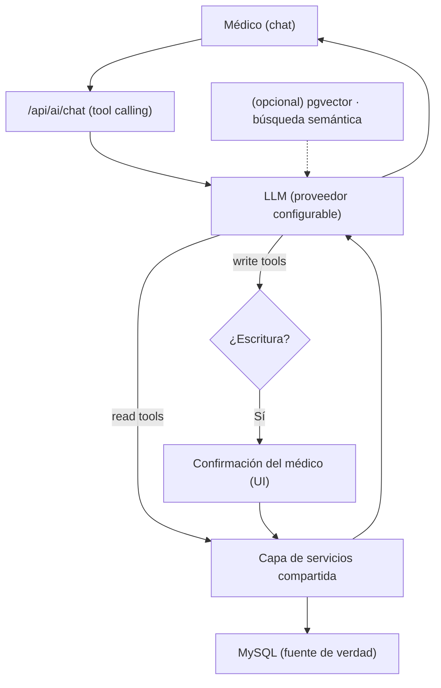

# Plan: Features de LLM para la clínica (asistente para médicos)

> Documento de planeación. **No implementado aún** (previsto ~próxima semana).
> Objetivo: no empezar de cero. Autor del contexto: sesión de migración a infra local.

## 1. Objetivo y alcance

Un asistente conversacional **interno, solo para médicos** de la clínica, que
consuma información **precisa y rápida** y pueda hacer **CRUD** sobre:
- Citas
- Tratamientos
- Facturas / pagos
- Historial clínico

No es para usuarios/pacientes finales. La prioridad es **exactitud** (no inventar
datos) y **velocidad**.

## 2. Decisión de arquitectura: **Tool calling**, no RAG

Para CRUD y consultas exactas, la herramienta correcta es **tool/function calling**
(el LLM traduce lenguaje natural → llamadas a herramientas → queries/endpoints
exactos → datos reales → el LLM redacta). **RAG/embeddings NO es el mecanismo
principal** (sirve para búsqueda semántica difusa sobre texto libre, y además
implica el riesgo de PII en vectores; ver §7).

| | Tool calling (elegido) | RAG (pgvector) |
|---|---|---|
| Bueno para | CRUD + datos exactos | Búsqueda semántica sobre texto libre |
| Precisión | Alta (datos de queries exactas) | Aproximada (similitud) |
| ¿Embeddings de PHI? | No | Sí (riesgo de inversión) |
| Reusa backend actual | Sí | Parcial |

## 3. Estado actual (base ya existente)

`routes/ai.js` **ya usa** el Vercel AI SDK con tool calling:
- `ai@^6`, `@ai-sdk/openai@^3`, modelo `gpt-4o`.
- `streamText` + `tool()` + `stepCountIs(10)`, SSE vía `pipeUIMessageStreamToResponse`.
- Tools existentes: `buscar_pacientes`, `resumen_paciente` (ejecutan queries reales).
- Endpoint protegido con JWT (`/api/ai`, `authenticateJwt`).

⚠️ Deuda: `ai.js` **reimplementa** la búsqueda de pacientes (duplica SQL de
`pacientes.js`). Ver §5 (capa de servicios compartida).

## 4. Arquitectura objetivo

## 5. Catálogo de herramientas (mapeo a dominios/endpoints)

| Dominio | Lectura | Escritura (con confirmación) | Rutas base actuales |
|---|---|---|---|
| Pacientes | `buscar_paciente` ✅, `resumen_paciente` ✅ | `crear/editar_paciente` | `/api/pacientes` |
| Citas | `listar_citas` | `agendar/reagendar/cancelar_cita` | `/api/pacientes/:id/citas` |
| Tratamientos | `listar_tratamientos`, `ver_tratamiento` | `crear/actualizar_estado_tratamiento` | `/api/pacientes/:id/tratamientos` |
| Facturas/Pagos | `listar_pagos`, `ver_factura` | `registrar_pago/factura` | `/api/pacientes/:id/pagos` |
| Historial | `ver_historial` | `agregar_entrada_historial` | `/api/clinical-histories` |

**Regla de mantenibilidad:** las tools deben llamar a una **capa de servicios
compartida** (como `services/patientSummaryService.js`), la misma que usan las
rutas REST. Un solo lugar para validación, permisos y lógica; no duplicar SQL.

## 6. Seguridad de las escrituras (crítico)

El LLM haciendo CRUD puede equivocarse/alucinar → nunca ejecutar mutaciones a ciegas:
- **Confirmación humana** antes de cada escritura (el médico aprueba la acción
  propuesta con sus parámetros exactos).
- **Validación estructurada** con `zod` en cada tool de escritura (ya se usa zod).
- **Permisos por rol** (JWT + `authorizePermissions`): solo médicos.
- **Auditoría**: log de cada acción del agente (quién/qué/cuándo). Base: extender
  `patient_treatment_events` o una tabla `agent_actions`.
- **Idempotencia / deshacer** donde sea posible.

## 7. Privacidad (PII/PHI) — es una clínica

**Hecho clave:** los embeddings vectoriales son **parcialmente invertibles** → no
son cifrado. Nunca generar embeddings de PII/PHI cruda sin anonimizar. Y con
cualquier API de proveedor, la PHI **viaja al tercero** en el prompt/resultados.

Mitigaciones (tool calling con API):
- **Proveedor con BAA/DPA + retención cero** antes de enviar datos reales.
- **Minimizar**: enviar solo campos necesarios; referenciar por **id interno**, no
  por nombre completo, cuando el modelo no necesite el nombre.
- **Redactar** texto libre (notas) antes de enviar (p. ej. Microsoft Presidio:
  `presidio-analyzer` + `presidio-anonymizer`, con placeholders **consistentes**
  como `<PERSON>` para no dañar la semántica).
- **Cifrado en reposo (AES-256)** y control de acceso; tratar vectores/prompts
  como reversibles.

Proveedores (verificar términos vigentes y firmar acuerdo):

| Proveedor | Para PHI |
|---|---|
| OpenAI / Anthropic (Claude) / Google Gemini (Vertex) | BAA/DPA + retención cero disponibles (empresarial/salud) |
| DeepSeek u opciones económicas | ⚠️ Precaución (residencia de datos); evitar con PHI cruda |

Estrategias de protección para el camino RAG (si se implementa §9):

| Estrategia | Ventaja | Desventaja | Seguridad |
|---|---|---|---|
| Redacción total | Máxima | Pierde contexto | Muy alta |
| Pseudonimización (tokens/ids) | Consistencia entre registros | Requiere BD de llaves segura | Alta |
| Cifrado homomórfico | Opera sobre cifrado | Complejidad/latencia extrema | Máxima |

## 8. Estrategia multi-proveedor

El Vercel AI SDK permite cambiar de proveedor cambiando el `model`
(`@ai-sdk/openai`, `@ai-sdk/anthropic`, `@ai-sdk/google`, …). Hacerlo
**configurable por env** (`AI_PROVIDER`, `AI_MODEL`, `AI_API_KEY`) para no atarse.
A futuro: soportar **modelo local** (self-hosted) para no mandar PHI afuera.

## 9. Opcional: RAG con pgvector (fase posterior)

Solo si se necesita **búsqueda semántica** sobre texto libre (notas, historial).
- Contenedor `pgvector/pgvector:pg16` (el NAS ya usa `:5432`; exponer en otro puerto).
- Tabla `documents(id, source_table, source_id, chunk, embedding vector(N), metadata jsonb, updated_at)`.
- **Anonimizar ANTES de vectorizar** (Presidio) + cifrado en reposo.
- Ingesta incremental por `updated_at`.
- NO requiere migrar toda la app a Postgres (MySQL sigue de fuente de verdad).

## 10. Plan por fases

1. **Lectura completa (bajo riesgo):** capa de servicios compartida + tools de solo
   lectura (citas, tratamientos, facturas, historial). Base ya existe.
2. **Escrituras con confirmación:** tools mutantes + UI de confirmación + zod + auditoría.
3. **Abstracción de proveedor + endurecer PHI** (BAA, minimización, redacción Presidio).
4. **(Opcional) RAG con pgvector** para búsqueda semántica, con anonimización previa.

## 11. Decisiones pendientes (definir antes de implementar)

- [ ] Proveedor(es) y si hay **BAA/retención cero** para PHI. ¿Multi-proveedor configurable?
- [ ] ¿La **confirmación de escrituras** va en el chat del frontend (botón aprobar)?
- [ ] ¿Modelo local a futuro (para no enviar PHI a terceros)?
- [ ] Alcance exacto de tools de la Fase 1.

## 12. Referencias
- PII en embeddings (defensa): https://philterd.ai/guides/pii-in-vector-embeddings-a-defense-guide/
- Presidio (Microsoft): `presidio-analyzer`, `presidio-anonymizer`
- Sentence Transformers (embeddings locales): `all-MiniLM-L6-v2`
- Vercel AI SDK (tool calling / multi-proveedor)
