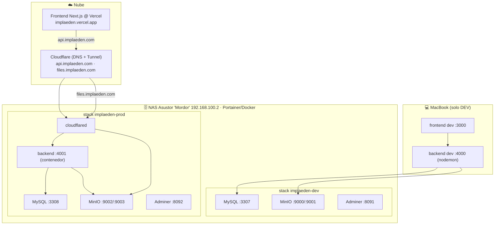

# Stack actual y guía de portabilidad — Implaedén

> Runbook del estado real: qué corre, dónde, cómo está conectado, y **qué se
> necesita para migrar los contenedores a otro servidor** (p. ej. la Beelink con
> Ubuntu). Los **secretos** viven en `infra/.env.dev` / `infra/.env.prod` y en los
> stacks de Portainer — **no** en este documento.
>
> Docs relacionados: `ESTADO_MIGRACION.md`, `migrations/README.md`, `PLAN_LLM_FEATURES.md`.

---

## 1. Topología actual



- **DEV:** BD/MinIO/Adminer en contenedores del NAS; **backend y frontend corren en la Mac** (hot-reload).
- **PROD:** todo en contenedores del NAS; **frontend en Vercel**; backend expuesto por Cloudflare Tunnel.

---

## 2. Inventario de servicios

### Stack `implaeden-dev` (NAS)
| Servicio (contenedor) | Imagen | Puerto host→int | Volumen / ruta en NAS |
|---|---|---|---|
| `implaeden-mysql-dev` | `mysql:8.0` | `3307→3306` | `…/implaeden-dev/mysql/{data,initdb}` |
| `implaeden-minio-dev` | `minio/minio` | `9000→9000`, `9001→9001` | `…/implaeden-dev/minio/data` |
| `implaeden-minio-init-dev` | `minio/mc` | one-shot | monta `…/implaeden-dev/minio-seed` |
| `implaeden-adminer-dev` | `adminer` | `8091→8080` | — |

### Stack `implaeden-prod` (NAS)
| Servicio (contenedor) | Imagen | Puerto host→int | Volumen / ruta en NAS |
|---|---|---|---|
| `implaeden-mysql-prod` | `mysql:8.0` | `3308→3306` | `…/implaeden-prod/mysql/{data,initdb}` |
| `implaeden-minio-prod` | `minio/minio` | `9002→9000`, `9003→9001` | `…/implaeden-prod/minio/data` |
| `implaeden-minio-init-prod` | `minio/mc` | one-shot | monta `…/implaeden-prod/minio-seed` |
| `implaeden-backend-prod` | `node:20-bookworm-slim` | `4001→4000` | bind-mount `…/implaeden-prod/backend` (código) |
| `implaeden-adminer-prod` | `adminer` | `8092→8080` | — |
| `implaeden-cloudflared-prod` | `cloudflare/cloudflared` | — (saliente) | token `TUNNEL_TOKEN` |

- Ruta base en el NAS: `/volume1/home/ochoagram/implaeden-{dev,prod}/`.
- Backend prod: imagen Node oficial + **código bind-mounteado** + `command: sh -c "… npm install --omit=dev … node app.js"`. Hay `Dockerfile` para imagen inmutable (recomendado al migrar, ver §8).
- Fuera de contenedor (DEV): backend `npm run dev` (nodemon) y frontend `npm run dev` en la Mac.

---

## 3. Red, acceso y exposición

| Aspecto | Valor |
|---|---|
| NAS (LAN) | `192.168.100.2` · alias SSH `mordor` (clave ed25519 de la Mac) |
| Docker en NAS | Docker 28.1.1 + Compose v2.35.1; gestionado por **Portainer** (el usuario no tiene acceso a socket/sudo → deploy vía Portainel) |
| Puertos DEV | MySQL 3307 · MinIO 9000/9001 · Adminer 8091 · backend(Mac) 4000 · frontend(Mac) 3000 |
| Puertos PROD | MySQL 3308 · MinIO 9002/9003 · Adminer 8092 · backend 4001 |
| Público (Tunnel) | `api.implaeden.com` → `backend:4000` · `files.implaeden.com` → `minio-prod:9000` |
| CORS backend | acepta `http://localhost:3000`, `https://implaeden.vercel.app` y patrón `implaeden-*.vercel.app` |
| Cookies auth | `token` (no-httpOnly, js-cookie, dominio Vercel) + `refreshToken` (httpOnly). Prod usa `COOKIE_SAMESITE=none` (cross-site) |

**Regla crítica:** el `JWT_SECRET` del backend **debe coincidir** con el del frontend (Vercel). Hoy ambos usan el heredado (ver `infra/.env.prod` / env de Vercel). Si no coinciden → login rebota.

---

## 4. Datos y almacenamiento

- **Dumps SQL** (origen): `sources_aws/dbs/` → dev = `dev-implaeden.sql` (21 tablas), prod = `implaeden-db.sql` (19 tablas). Tras migración `002`, **ambos esquemas idénticos**.
- **Carga inicial**: los `.sql` en `…/mysql/initdb` se ejecutan solo en el **primer arranque** (volumen vacío).
- **Archivos (MinIO)**: bucket `implaeden` con `blog/`, `clinical_histories/`, `evidencias/`, `profile_photos/`. Respaldo original: `sources_aws/bucket/` (~183 MB / 250 archivos), sembrado con `mc mirror`.
- **URLs en BD**: reescritas de `…s3.amazonaws.com` → `https://files.implaeden.com/implaeden/…`.
- **Content-Type en MinIO**: corregido por *magic bytes* (los `_blob` sin extensión quedaban `octet-stream`).
- **Persistencia**: bind-mounts en el NAS (fáciles de respaldar/inspeccionar).

---

## 5. Dependencias externas

| Servicio | Uso | Nota |
|---|---|---|
| **Vercel** | Hosting del frontend | `NEXT_PUBLIC_API_URL=https://api.implaeden.com/api`; `next.config.mjs` → `remotePatterns` incluye `files.implaeden.com` |
| **Cloudflare** | DNS de `implaeden.com` + Tunnel | Tunnel con connector `cloudflared`; public hostnames `api` y `files`; el `TUNNEL_TOKEN` es secreto |
| **OpenAI** | `/api/ai/chat` (tool calling) | `@ai-sdk/openai`, modelo `gpt-4o`; futuro: LLM local (ver `PLAN_LLM_FEATURES.md`) |
| **AWS Polly** | TTS `/resumen/tts` | En prod **sin llaves AWS** → deshabilitado de facto (decisión §6 del setup) |
| **SMTP (Gmail)** | Endpoints `/email` | Credenciales en env |

---

## 6. Código / configuración relevante (backend)

- `config/s3.js` — cliente S3 compartido (MinIO si hay `S3_ENDPOINT`, AWS S3 si no); `publicUrl()`.
- Rutas de subida (`uploads`, `treatmentEvidences`, `pacientes`, `clinicalHistories`, `tratamientos`) usan el cliente compartido + `publicUrl`.
- `auth.js` — cookie de refresh con `COOKIE_SAMESITE` (dev `lax`, prod `none`+`secure`).
- `pacientes.js` — `LIMIT/OFFSET` como enteros (MySQL 8).
- **Migraciones**: `scripts/migrate.js` + `migrations/` (`schema_migrations`). Ver `migrations/README.md`.
- Variables por entorno: `.env.development` (dev, en la Mac) y env inyectado por compose (prod). En contenedor **no** se copia `.env.production`.

---

## 7. Arranque desde cero (referencia)

1. Crear rutas bind-mount en el host (`mysql/{data,initdb}`, `minio/{data}`, `minio-seed`, `backend`, `compose`).
2. Colocar el dump en `mysql/initdb/` y el respaldo de archivos en `minio-seed/`.
3. Desplegar el stack (Portainer o `docker compose up -d`). MySQL carga el dump; `minio-init` crea bucket + política pública + `mc mirror` del seed.
4. Backend prod: al arrancar hace `npm install` (o usar imagen del `Dockerfile`).
5. Correr migraciones pendientes (`npm run migrate`).
6. (Prod) `cloudflared` con su token + public hostnames → verificar `api`/`files`.

---

## 8. Guía de portabilidad — migrar a otro servidor (Beelink + Ubuntu)

> Objetivo: mover los contenedores a la Beelink (Ubuntu) como *home lab* central,
> conservando NAS para almacenamiento pesado (MinIO) y respaldo en frío.

### 8.1 Ventaja de Ubuntu vs el NAS
En Ubuntu tienes **Docker Engine + Compose nativos y acceso root** → puedes:
- Usar `docker`/`docker compose` por CLI (y/o Portainer si lo prefieres).
- **Construir la imagen del backend con el `Dockerfile`** (`docker build`) → imagen **inmutable**, sin el hack de bind-mount + `npm install` que usamos en el NAS. **Recomendado migrar a esto.**

### 8.2 Prerrequisitos en la Beelink/Ubuntu
- Ubuntu Server LTS + `docker-ce` + `docker compose` plugin.
- Usuario en el grupo `docker`.
- (Opcional) Portainer.
- (Opcional) **Reverse proxy** (Traefik/Caddy/nginx) si vas a hostear **varios proyectos** en el mismo box → enruta por dominio/subdominio y evita choques de puertos.
- IP fija en LAN + 10 GbE hacia el NAS.

### 8.3 Qué mover (checklist)
- [ ] **Compose files**: `infra/docker-compose.dev.yml` y `docker-compose.prod.yml` (ajustar rutas bind-mount `/volume1/home/ochoagram/…` → p. ej. `/opt/implaeden/…`).
- [ ] **Secretos/env**: recrear `infra/.env.dev` / `.env.prod` (o inyectar por env del compose). Mantener `JWT_SECRET` = el del frontend Vercel.
- [ ] **Código backend**: si usas el `Dockerfile`, basta el repo; si sigues con bind-mount, copiar `implaeden_backend/` (sin `node_modules`/`.env`).
- [ ] **Datos MySQL**: **no** copies el directorio `mysql/data` entre versiones/arquitecturas; en su lugar **`mysqldump`** de cada BD (dev/prod) → cargar en el nuevo contenedor (initdb o import). Luego `npm run migrate`.
- [ ] **Datos MinIO**: `rsync` del contenido (o `mc mirror` entre instancias). Decisión: **MinIO puede quedarse en el NAS** (almacenamiento pesado) y el backend en la Beelink apuntar a él por 10 GbE (`S3_ENDPOINT=http://<nas>:9002`).
- [ ] **Cloudflare Tunnel**: mover `cloudflared` a la Beelink (mismo token, o crear túnel nuevo). Los public hostnames apuntan a los servicios por su nombre en la **red Docker de la Beelink** (`backend:4000`, `minio:9000`). Si MinIO se queda en el NAS, el hostname `files` apunta a la IP del NAS.
- [ ] **DNS/Vercel**: si cambia el hostname público, actualizar `NEXT_PUBLIC_API_URL` en Vercel + `remotePatterns` en `next.config.mjs`.
- [ ] **Puertos**: en un box dedicado puedes usar puertos limpios; mantén **dev/prod separados** (nombres/volúmenes/puertos distintos) y aislados de los otros proyectos (redes Docker por proyecto).

### 8.4 Gotchas aprendidos (no repetir)
- `JWT_SECRET` backend **debe** = frontend (si no, login rebota y borra cookie).
- MySQL 8 rechaza `LIMIT '20'` (parámetros numéricos como enteros).
- `mc mirror` pierde el Content-Type → correr el fix de *magic bytes* tras sembrar.
- `next/image` exige el host en `remotePatterns` (agregar el nuevo dominio de archivos).
- Backend en contenedor: `npm ci` falla si `package-lock.json` está desincronizado (proyecto usa yarn) → usar `npm install` o construir con el `Dockerfile`.
- Cookies cross-site: `COOKIE_SAMESITE=none` + `secure` en prod.
- No martillar SSH al NAS (auto-block).

### 8.5 Orden de migración sugerido
1. Levantar infra base en la Beelink (MySQL, MinIO —o dejar MinIO en NAS—, Adminer).
2. `mysqldump` dev/prod del NAS → importar en la Beelich → `npm run migrate`.
3. Migrar archivos MinIO (o reapuntar al NAS).
4. Backend: construir imagen (`Dockerfile`) y levantar; verificar `db-test` y una subida.
5. Mover `cloudflared` + verificar `api`/`files`.
6. Actualizar Vercel si cambió algo. Verificación end-to-end.

---

## 9. Arquitectura objetivo del home lab

```mermaid
flowchart LR
    subgraph BEE["🖥️ Beelink (Ubuntu) — cómputo/servidor"]
        RP["Reverse proxy (opcional)"]
        A1["Implaedén: back + MySQL + pgvector + cloudflared"]
        A2["Proyecto B: front/back/db"]
        A3["Proyecto C: …"]
    end
    subgraph NAS["🗄️ NAS Asustor Flashstor — almacenamiento"]
        MIN["MinIO (archivos pesados)"]
        BK["Backups (dumps + snapshots)"]
    end
    COLD["❄️ Respaldo en frío (discos 3.5\")"]
    BEE <-->|10 GbE| NAS
    NAS --> COLD
```

- **Beelink (Ubuntu):** cómputo y contenedores de todos los proyectos (misma filosofía). Redes Docker separadas por proyecto; reverse proxy si compartes dominios.
- **NAS Flashstor:** almacenamiento pesado (MinIO) y **backups** (dumps de BD + snapshots de MinIO).
- **Respaldo en frío (3.5"):** copia periódica offline de los backups del NAS (regla 3-2-1).
- **Enlace 10 GbE** Beelink↔NAS para servir archivos rápido.

### Pendiente de infra al montar el home lab
- Backups automáticos (dump MySQL + copia `minio/data`) del NAS → discos fríos.
- Reverse proxy + política de puertos/redes por proyecto.
- (Futuro) nodo LLM local (Mac Mini M4 Pro / Mac Studio / GPU) exponiendo API compatible OpenAI → `AI_PROVIDER=local` (ver `PLAN_LLM_FEATURES.md`).
